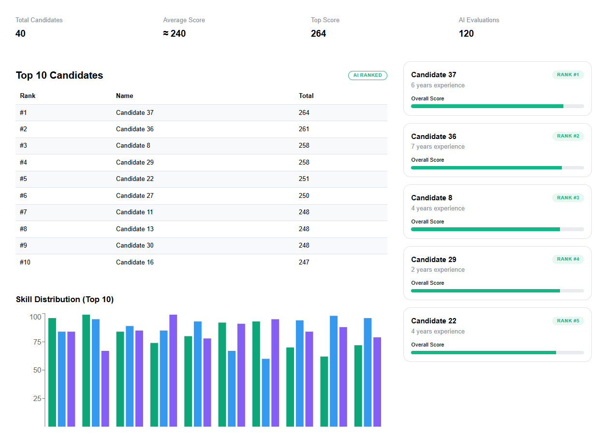

# Recycling Production Line Manager – AI Candidate Ranking System

This project is a minimal AI-assisted system for evaluating and ranking candidates for a recycling production line manager role.  
It demonstrates database design, AI prompting, and a modern dashboard for decision support.

---

## Features

- MySQL-compatible database schema for candidates, evaluations, and rankings
- Random candidate generation using Faker.js
- AI-style evaluation using structured prompts (mocked responses)
- Automatic score aggregation and ranking logic
- Interactive dashboard built with React, Vite, and Mantine UI
- Leaderboard, skill comparison heatmap, and candidate overview cards

---

## AI Evaluation Criteria

Each candidate is evaluated on three dimensions:
1. Crisis Management
2. Sustainability Knowledge
3. Team Motivation

Scores range from **0–100** per category and are aggregated to determine rankings.

AI responses are mocked to simulate realistic evaluation behavior.

---

## Database Structure

### Tables
- `candidates` – basic profile, experience, skills
- `evaluations` – AI-generated scores
- `rankings` – total score and rank position

### Ranking Logic
- Total score = sum of all evaluation scores
- Rankings are recalculated using a batch SQL script:


## 🎲 Random Data Generation

Candidate profiles are generated using **Faker.js** with realistic ranges for:
- Experience
- Leadership
- Safety management
- Recycling knowledge

File:generateCandidates.js



---

## 📊 Dashboard Overview

The dashboard provides:
- **Top 10 Leaderboard** – ranked by AI score
- **Skill Heatmap** – horizontal bar comparison of AI scores
- **Candidate Cards** – quick overview of top candidates

Built with:
- React + Vite
- Mantine UI
- Recharts
- Framer Motion (animations)

---

## 🛠️ Setup Instructions

### Backend (Database)
1. Create a MySQL database
2. Run:
   - `schema.sql`
   - `seed.sql`
3. After inserting evaluations, run:
   - `update_rankings.sql`

### Frontend
```bash
cd Frontend/production-system
npm install
npm run dev

